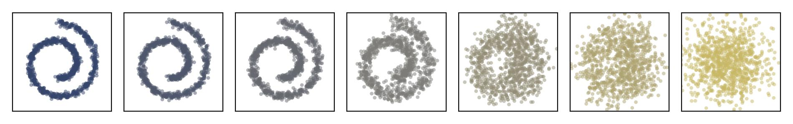
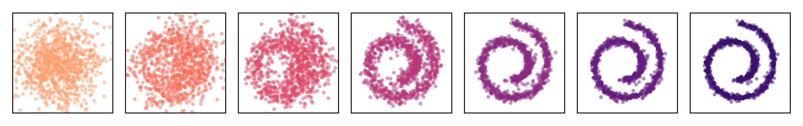
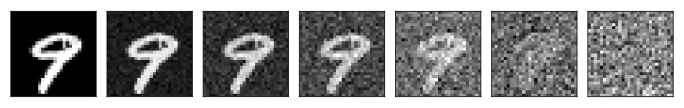
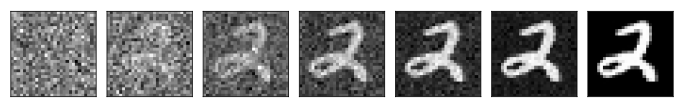

# PyTorch denoising diffusion demo

The repository contains a simple PyTorch-based demonstration of denoising diffusion models.
It just aims at providing a first understanding of this generative modeling approach.

A short theoretical intro to standard DDPMs can be found [here](notebooks/intro_1_ddpm.ipynb).
DDIMs for accelerated sampling are discussed in the [companion notebook](notebooks/intro_2_ddim.ipynb).
Two example applications establish a small experimentation playground.
They are prepared in such a way that they can be easily modified and extended.

## Notebooks

- [Introduction to DDPMs](notebooks/intro_1_ddpm.ipynb)

- [Introduction to DDIMs](notebooks/intro_2_ddim.ipynb)

- [Swiss roll example](notebooks/swissroll.ipynb)

- [Unconditional model on MNIST](notebooks/mnist_uncond.ipynb)

- [Conditional model on MNIST](notebooks/mnist_cond.ipynb)

## Swiss roll

As a first example, a generative DDPM is trained on a 2D Swiss roll distribution.
The main training script can be called to that end with a config file
that allows one to adjust the problem setup and model definition:
```
python scripts/main.py fit --config config/swissroll.yaml
```
After the training has finished, the final model can be tested and analyzed in [this notebook](notebooks/swissroll.ipynb).

For monitoring the experiment, one can locally run a TensorBoard server by `tensorboard --logdir run/swissroll/`.
It can be reached under [localhost:6006](http://localhost:6006) per default in your browser.
As an alternative, one may use MLfLow for managing experiments.
In this case, one can launch the training with the appropriate settings
and set up a tracking server by `mlflow server --backend-store-uri file:./run/mlruns/`.
It can then be reached under [localhost:5000](http://localhost:5000).

<p>
  
</p>

<p>
  
</p>

## MNIST

The second application is based on the MNIST dataset.
Here, one can construct a DDPM that is either unconditioned (generates randomly) or conditioned on the class (generates controllably).
Such models generating images of handwritten digits can be learned by running the main script in the following ways:
```
python scripts/main.py fit --config config/mnist_uncond.yaml
```
```
python scripts/main.py fit --config config/mnist_cond.yaml
```
Two dedicated notebooks [here](notebooks/mnist_uncond.ipynb) and [here](notebooks/mnist_cond.ipynb)
are provided in order to test the unconditional and the conditional model after training, respectively.

<p>
  
</p>

<p>
  
</p>

